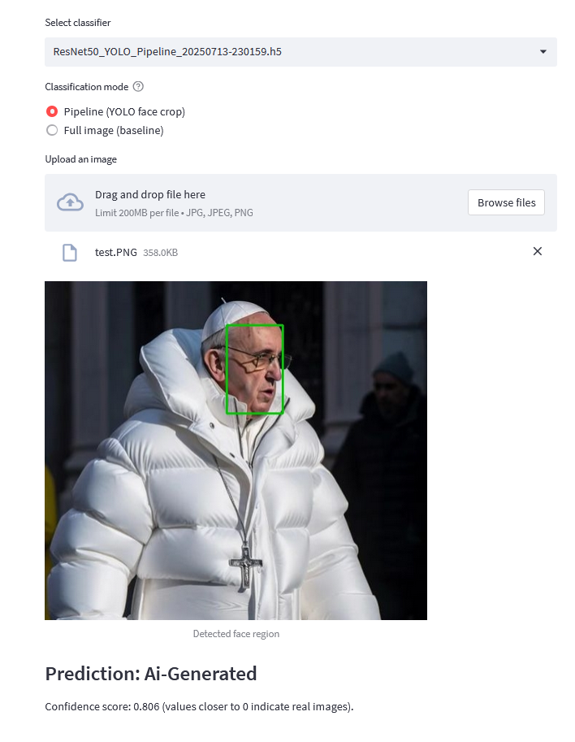

# AI Image Detector

Identify whether a portrait was generated by an AI model or captured in the real world. The project combines face extraction via YOLOv8 with a set of TensorFlow classifiers (ResNet50 and MobileNetV2) and provides Streamlit apps for interactive exploration.  
The repository was trimmed for submission—only the core scripts, logs, and essential documentation remain. Runtime assets such as datasets or pretrained weights are created via the provided tooling.



## Highlights
- Streamlit dashboards for drag-and-drop inference with optional Grad-CAM explanations.
- Automated Kaggle download and sorting pipeline to build the `Data/` directory.
- YOLOv8 face detector training scripts plus ready-to-use weight loader.
- Multiple training recipes (MobileNetV2, ResNet50, YOLO-assisted ResNet) with reproducible callbacks and logging.
- Clean submission footprint: generated assets (`Data/`, `Models/`, figures) are recreated when needed.

## Repository Layout
```
AI-Image-Detector/
├── Scripts/
│   ├── App/                      # Streamlit front-ends
│   ├── PrepData/                 # Dataset and model download tools
│   ├── Trainer/                  # Training pipelines for classifiers and YOLO
│   └── requirements.txt          # Python dependencies
├── docs/
│   └── raw_training_artifacts/   # Example outputs, curves, and debugging notes
├── logs/                         # TensorBoard runs written while training
├── image.png                     # Placeholder asset (kept for reference)
└── README.md

> Directories such as `Data/`, `Models/`, or `docs/figures/` are generated by the scripts and intentionally left out of this submission. Recreate them following the quickstart steps.
```

## Quickstart
1. **Prerequisites**
   - Python 3.10 or newer (GPU with CUDA and cuDNN recommended).
   - Kaggle CLI configured (`~/.kaggle/kaggle.json`) for dataset downloads.
   - Optional Hugging Face token if you want to pull published checkpoints.

2. **Create an environment**
   ```bash
   python -m venv .venv
   .venv\Scripts\activate            # Windows
   pip install --upgrade pip
   pip install -r Scripts/requirements.txt
   ```

3. **Populate the dataset**
   ```bash
   python Scripts/PrepData/fetch_data.py
   ```
   - Choose `0` to download all pre-configured Kaggle datasets, or pick one by index.
   - The script prepares `Data/train|validation|test/{real,fake}` with balanced splits.
   - Use `Scripts/PrepData/sort_kaggle_data.py` for a guided GUI workflow if you already extracted archives manually.

4. **Fetch pretrained models (optional but recommended)**
   ```bash
   set HF_TOKEN=hf_your_token        # Windows PowerShell
   python Scripts/PrepData/download_all_models.py
   ```
   - Downloads every model repository owned by `HF_USERNAME` into `Models/<repo_name>/...`.
   - Current layout on Hugging Face:
     - `realr4an/ResNet50_20250710-061102` → `Models/ResNet50_20250710-061102/ResNet50_20250710-061102.h5`
     - `realr4an/ResNet50_YOLO_Pipeline_20250713-230159` → `Models/ResNet50_YOLO_Pipeline_20250713-230159/ResNet50_YOLO_Pipeline_20250713-230159.h5`
     - `realr4an/yolov8_face_detector` → `Models/YOLOv8_Face_Detection/weights/best.pt` plus logs (mirrors the training folder structure)
     - `realr4an/old_models` → archival checkpoints under `Models/old_models/`
   - Streamlit apps (see below) search recursively, so the downloaded `.h5` checkpoints work out of the box without moving files.
   - Ultralytics base checkpoints (e.g., `yolov8n.pt`) are not part of these repos—either let the YOLO trainer fetch them on first run or place the files manually before running the apps.

## Running the Apps
- **Face pipeline with YOLO cropping**  
  ```bash
  streamlit run Scripts/App/app_new.py
  ```
  Select a `.h5` model from the detected list and upload a portrait. The app shows the YOLO face crop, the predicted label (real vs AI generated), and the confidence score.

- **Grad-CAM explainer**  
  ```bash
  streamlit run Scripts/App/app.py
  ```
  Visualises the attention map that drove the prediction for deeper insight.

- **Lightweight classifier UI**  
  ```bash
  streamlit run Scripts/App/alternative_app.py
  ```
  Focused on fast binary classification with minimal UI.

Place additional classifier checkpoints in `Models/` (or within its subdirectories) so the apps can auto-discover them.

## Training Playbook

### 1. YOLOv8 face detector
```bash
python Scripts/Trainer/FaceExtractionTrainer.py
```
- Downloads the WIDER FACE dataset, converts annotations to YOLO format, and fine-tunes the detector.  
- Stores weights at `Models/YOLOv8_Face_Detection/YOLOv8_Face_Detection/weights/best.pt` (auto-created if missing).

### 2. Baseline classifiers
- **ResNet50**
  ```bash
  python Scripts/Trainer/ModelTrainerResNet50.py
  ```
- **MobileNetV2**
  ```bash
  python Scripts/Trainer/ModelTrainerMobileNetV2.py
  ```
Both scripts:
- Enable mixed precision automatically when GPUs are available.
- Read images from `Data/{train,validation,test}`.
- Save the best `.h5` checkpoint into `Models/` with timestamped names.
- Write TensorBoard logs into `logs/fit/...` and evaluate on the test split when present.

### 3. YOLO-assisted ResNet pipeline
```bash
python Scripts/Trainer/DeepfakePipelineTrainer.py
```
- Uses the YOLO detector to crop faces on the fly before feeding them into a ResNet50 head.
- Requires `Models/YOLOv8_Face_Detection/weights/best.pt`; run the face trainer or download published weights first.

### 4. Model evaluation
```bash
python Scripts/evaluate_models.py
```
- Iterates over every `.h5` checkpoint inside `Models/` (recursively).
- Prints accuracy, precision, recall, and F1 score on the held-out test set.

## Data & Assets
- `Data/` is intentionally excluded from version control. Regenerate via the prep scripts or drop curated content there manually.
- `Models/` is likewise generated on demand. The helper downloads each Hugging Face repo into its own subdirectory; tools such as the Streamlit apps and `Scripts/evaluate_models.py` traverse the tree recursively and will discover `.h5` checkpoints wherever they land.
- `docs/raw_training_artifacts/` contains representative plots, confusion matrices, and short lab notes to document previous experiments.
- Additional derived figures/logs (`docs/figures`, `docs/training_logs`, thesis sources, etc.) were removed for the submission package—restore them from your working copy if needed.

## Troubleshooting
- **YOLO weights missing** – run the face trainer or `download_all_models.py` with a valid Hugging Face token.
- **Kaggle rate limits** – add `--quiet` or configure Kaggle API throttling; cached downloads are kept under `downloads/` during a run.
- **Large GPU memory usage** – reduce `batch_size` in trainer scripts or disable mixed precision by removing the policy setup.
- **Streamlit cannot find models** – ensure `.h5` files reside inside `Models/` (nested folders are supported).

## Next Steps
- Package the training utilities into a CLI (e.g. Typer or Click) for more automation.
- Upload curated checkpoints to a public Hub repository for reproducible baselines.
- Add unit tests around the data preparation pipeline to guard against dataset changes.
